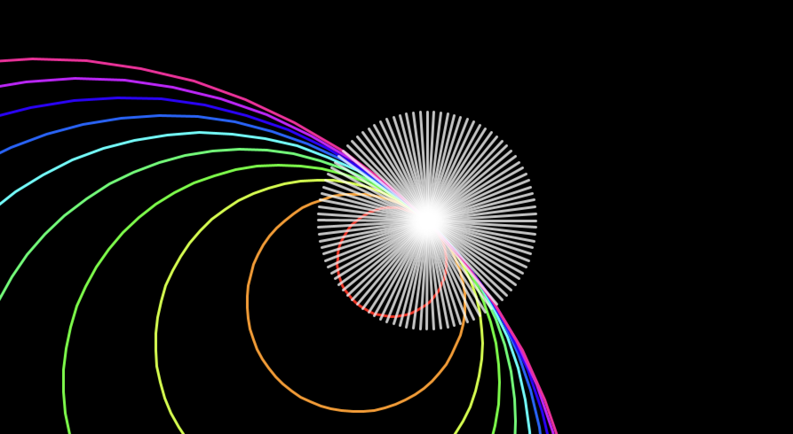
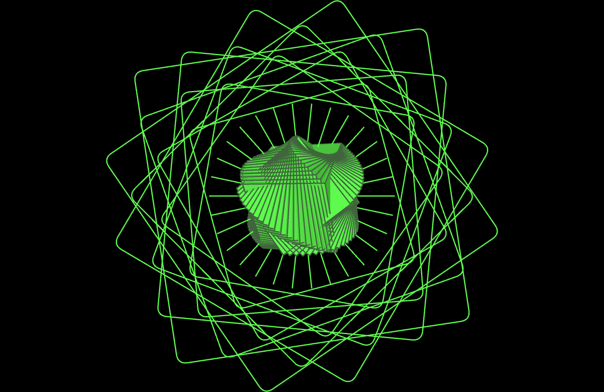
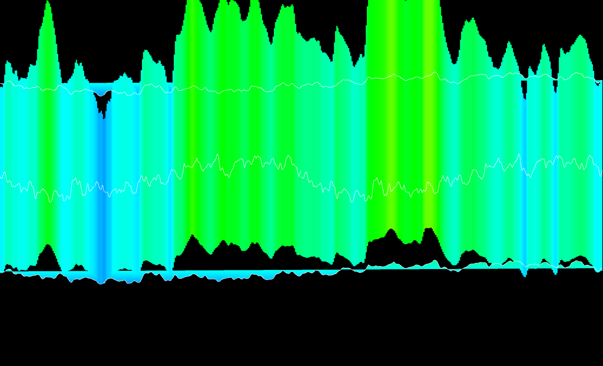

# Music Visualiser Project

Audio Name: Crazy Frog - Axel F

| Name | Student Number |
|-----------|-----------|
|Amy Ibourk | C22308773 |
|Roxana Rakhmatullina | C21374751 |
|Ciara Trani | C22787471 |
|Aleena Mattathil | C22790201 |

## Video
[](https://youtu.be/r7nN0u-_N_8)

# Screenshots
### Visual 1


### Visual 2

### Visual 3

### Visual 4


### Visual 5


# Description of the Project
Using Processing, our team created visuals for our chosen audio Axel F by Crazy Frog. Aleena had to have 2 visuals as the music repeated and also so we all had a similar limit of time to work on. Her visual shows a swirl. Ciaras visual shows rainbow scribbles moving around.Amys visual shows a rose like flower shape and then exposes another abstract shape inside it. It expands to the beat.Roxanas visual is of a frog image that bounces up and down the screen bouncing off the wall and every time it lands on the ground it squishes. Ther is a rainow aura around the frog and also rainbow grass at the bottom of the screen 

# How it works
By clicking a key it switches between our visuals, Amy is 1 ,Aleena is 5 ,Ciara is 4 ,Roxana is 2 .
# What I am most proud of in the assignment
-ROXANA
- I chose the song for this and im half proud of myself and half hate myself for choosing such an upbeat, classic and fun yet such an annoying somehwta repetetive song,
- I also notes the time stamps for the code which we then changed it to just have a switch case but its the thought that counts
- I am also proud of how I got the frog to squish whever it landed while hopping, I found it quite hard to do and it did have issues with it line it would stay squished the whole time or not be there at all. 
- Time stamps : 0-27s Amy, 28-42s Aleena, 43-1.10s Roxana, 1.11-1.24s Aleena, 1.24-1.50s Ciara

-Amy
- 
- 
- 

# Markdown Tutorial

This is *emphasis*

This is a bulleted list

- Item
- Item

This is a numbered list

1. Item
1. Item

This is a [hyperlink](http://bryanduggan.org)

# Headings
## Headings
#### Headings
##### Headings

This is code:

```Java
public void render()
{
	ui.noFill();
	ui.stroke(255);
	ui.rect(x, y, width, height);
	ui.textAlign(PApplet.CENTER, PApplet.CENTER);
	ui.text(text, x + width * 0.5f, y + height * 0.5f);
}
```

So is this without specifying the language:

```
public void render()
{
	ui.noFill();
	ui.stroke(255);
	ui.rect(x, y, width, height);
	ui.textAlign(PApplet.CENTER, PApplet.CENTER);
	ui.text(text, x + width * 0.5f, y + height * 0.5f);
}
```

This is an image using a relative URL:


This is an image using an absolute URL:


This is a youtube video:

[](https://www.youtube.com/watch?v=J2kHSSFA4NU)

This is a table:


