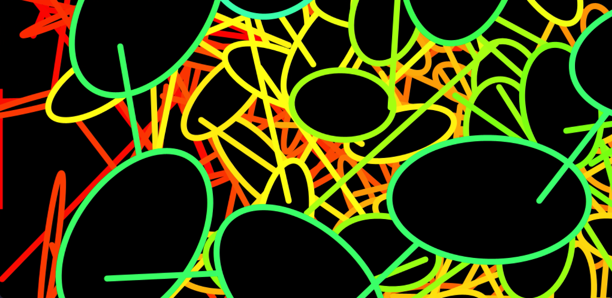

# Music Visualiser Project

Audio Name: Crazy Frog - Axel F

| Name | Student Number |
|-----------|-----------|
|Amy Ibourk | C22308773 |
|Roxana Rakhmatullina | C21374751 |
|Ciara Trani | C22787471 |
|Aleena Mattathil | C22790201 |

## Video
[](https://youtu.be/r7nN0u-_N_8)

# Screenshots
### Visual 1


### Visual 2
(images/RoxanaVisual1-2.png)

### Visual 3



### Visual 4


### Visual 5


# Description of the Project
Using Processing, our team created visuals for our chosen audio Axel F by Crazy Frog. Aleena had to have 2 visuals as the music repeated and also so we all had a similar limit of time to work on. Her visual shows a swirl. Ciara's visual shows rainbow scribbles moving around.Amy's visual shows a rose like flower shape and then exposes another abstract shape inside it. It expands to the beat. Roxana's visual is of a frog image that bounces up and down the screen bouncing off the wall and every time it lands on the ground it squishes. There is a rainow aura around the frog and also rainbow grass at the bottom of the screen.

# How it works
There is a switch statement with the number keys allowing us to switch between each visual. Amy's visual is 1, Roxana's is 2, Ciara's is 3 and Aleena's are 4 and 5. We also implemented the visuals automatically changing according to the timing of the song. Time stamps : 0-27s Amy, 28-42s Aleena, 43-1.10s Roxana, 1.11-1.24s Aleena, 1.24-1.50s Ciara

### AmyVisual1
In this visual, there are 3 elements:
1. There are 24 rotating cubes displayed using a for loop to create a visual in the centre of the screen. The size and colour are dependant on the amplitude of the audio. The rotation variable gives it a spinning effect as it increments by 0.1 each time render() is called (60 times per second).
1. Then there is a lines from centre visual. 30 lines are created using a for loop. The lines start from the centre and radiate outwards. The colour and length of each line is based on the amplitude.
1. The outer pattern is created by an array of squares. It begins by every square being initialised, each one being slightly bigger and rotated more than the previous. In render() it calls the method display() from the square class to  change the colour and sized depending on the almplitude and spin the squares around.

### AleenaVisual1
- 

### AleenaVisual2
- 

### RoxanaVisual1
- 

### CiaraVisual1
- 


# What I am most proud of in the assignment
### Roxana
- I chose the song for this and im half proud of myself and half hate myself for choosing such an upbeat, classic and fun yet such an annoying somehwta repetetive song,
- I also notes the time stamps for the code which we then changed it to just have a switch case but its the thought that counts
- I am also proud of how I got the frog to squish whever it landed while hopping, I found it quite hard to do and it did have issues with it line it would stay squished the whole time or not be there at all. 

### Ciara
- I'm most proud of how this project showcases our creative individuality. I like how different and unique each of our visuals are from each other and I think it suits the music that we've chosen. The aspect I love the most about my part is the fast movement of the shapes and lines. It goes well with the upbeat song in the background.

### Amy
- Firstly, I am proud of how well our group worked together. We met up a few times to work on our project together, as well as asked eachother for help when we needed it.
- I am also happy with how my visual turned out. Though, I had a few issues throughout the process of making it perfect, I managed to do what I aimed to do.

### Aleena
- 
- 
- 

# Markdown Tutorial

This is *emphasis*

This is a bulleted list

- Item
- Item

This is a numbered list

1. Item
1. Item

This is a [hyperlink](http://bryanduggan.org)

# Headings
## Headings
#### Headings
##### Headings

This is code:

```Java
public void render()
{
	ui.noFill();
	ui.stroke(255);
	ui.rect(x, y, width, height);
	ui.textAlign(PApplet.CENTER, PApplet.CENTER);
	ui.text(text, x + width * 0.5f, y + height * 0.5f);
}
```

So is this without specifying the language:

```
public void render()
{
	ui.noFill();
	ui.stroke(255);
	ui.rect(x, y, width, height);
	ui.textAlign(PApplet.CENTER, PApplet.CENTER);
	ui.text(text, x + width * 0.5f, y + height * 0.5f);
}
```

This is an image using a relative URL:


This is an image using an absolute URL:


This is a youtube video:

[](https://www.youtube.com/watch?v=J2kHSSFA4NU)

This is a table:


